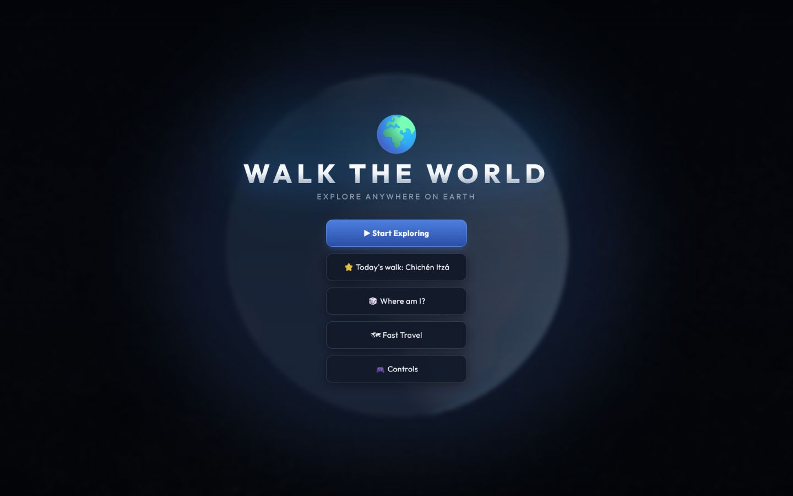
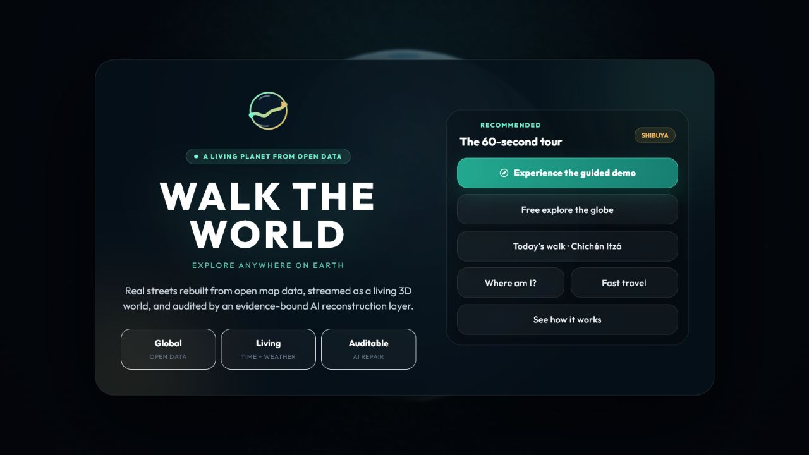
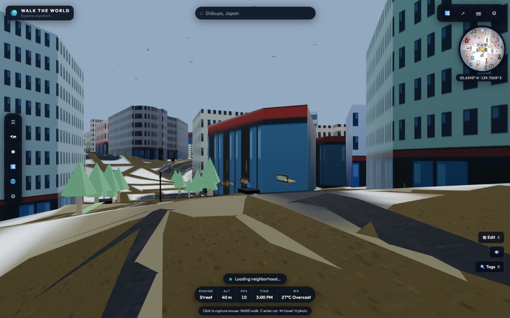
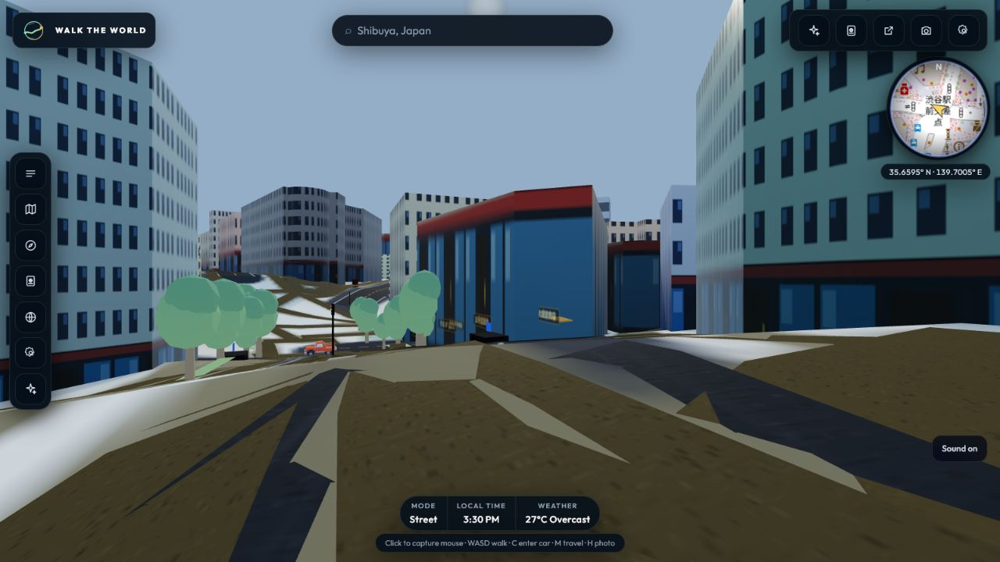
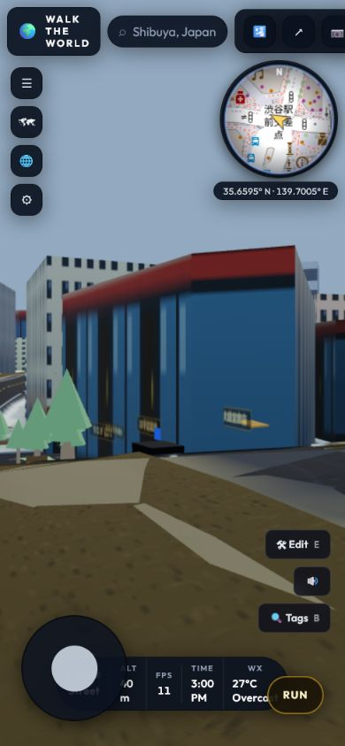
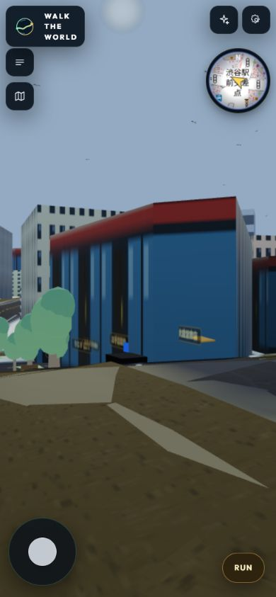
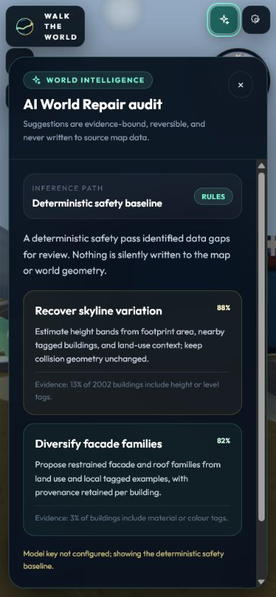

# Walk the World — Before / After

Captured on 2026-07-13 from the same local production build target at matched
desktop and mobile viewport sizes.

## Desktop menu

| Before | After |
|---|---|
|  |  |

The generic game menu is now a portfolio opening: a custom identity, a concise
product thesis, a one-click 60-second route, and three clear engineering pillars.

## Desktop street

| Before | After |
|---|---|
|  |  |

The street view now prioritizes the world. Mixed emoji controls, persistent editor
buttons, FPS/elevation noise, and an ambiguous loading banner have been replaced by
a restrained SVG HUD, explicit streaming state, hidden developer tools, and improved
instanced vegetation silhouettes.

## Mobile street

| Before | After |
|---|---|
|  |  |

The after view removes the overlapping status/editor controls, reduces the minimap,
shrinks movement controls, and preserves substantially more of the scene.

## Visible AI development proof

World Repair constructs a structured world summary and produces deterministic local
recommendations with confidence, evidence, and provenance. It uses no paid model or
external AI API. Suggestions remain reversible and do not silently modify source data.

## Verified evidence

| Check | Before | After |
|---|---:|---:|
| Unit tests | 27 passing | 29 passing |
| Menu first-load JS | 109 kB | 112 kB |
| Street first-load JS | 93.6 kB | 93.7 kB |
| Flagship browser console | Missing GLTF texture error | 0 errors, 0 warnings |
| Mobile HUD collisions | Present | Removed in the captured flagship path |
| Developer controls in normal mode | Visible | Hidden by default |
| AI contribution visible | No | Yes, with confidence, evidence, provenance, and fallback |

The small menu bundle increase pays for the portfolio story and guided route. The
street bundle remains effectively flat. FPS is intentionally not claimed as improved:
the old screenshots exposed a development counter, while the new product mode hides
it. `PERFORMANCE-BUDGETS.md` defines the controlled production benchmark required
before making a frame-rate claim.

## What remains external or long-running

- Deploy the public URL and run the real-device/browser matrix.
- Populate the 30-cell AI evaluation set and conduct five first-time-user sessions.
- Complete the deeper engine decomposition, LOD, pre-baked geometry, and 15-minute
  memory/frame-pacing work described in `plan2.md`.
