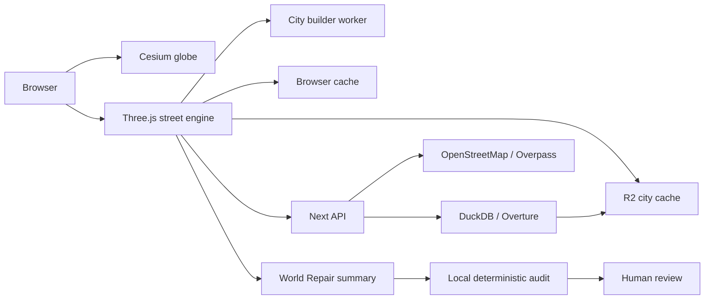

# Walk the World

> Pick any place on Earth and explore a living 3D interpretation
> of its real streets.

Walk the World is a browser-based planetary exploration engine. A Cesium globe
handles global travel; a custom Three.js engine reconstructs street-level cells
from open geospatial data, streams neighboring streets, and layers in time,
weather, traffic, pedestrians, audio, vehicles, photo mode, and editing tools.

The guided portfolio route demonstrates the product in about 60 seconds. Free
exploration remains available for any coordinate.

## Before and after

| Baseline | Portfolio pass |
|---|---|
|  |  |
|  |  |

See [`BEFORE-AFTER.md`](BEFORE-AFTER.md) for the measured comparison and mobile views.

## Why it is technically interesting

- A globe-to-street transition joins two different rendering approaches.
- World cells are fetched from OpenStreetMap/Overpass, cached in the browser and
  Cloudflare R2, and assembled into merged geometry in a Web Worker.
- Overture buildings can fill sparse cells through a DuckDB-over-S3 query path;
  generated cell results are cached back to R2.
- Neighbor cells stream and evict while the player walks.
- Adaptive quality, instancing, ref-driven HUD updates, indexed ground height,
  and progressive terrain-first rendering protect responsiveness.
- A living-city layer adds weather, time, traffic, pedestrians, birds, audio,
  drivable cars, photo mode, a walk passport, and touch controls.
- An editor can place GLB assets, sculpt terrain, hide broken features, and
  persist per-cell corrections.

## Local World Repair

World Repair is a constrained reconstruction audit, not a generic chatbot. It
summarizes observable map coverage and produces deterministic recommendations with:

- numerical evidence;
- confidence and risk;
- explicit provenance;
- no invented businesses, landmarks, history, or exact geometry;
- human review for topology-sensitive changes.

It runs entirely inside this application with no paid model, API key, or external
AI service. The rules are versionable, testable, fast, and honest about their
evidence. The architecture can later accept an open model without changing the
review contract.

Evaluation design is documented in [`AI-EVALUATION.md`](AI-EVALUATION.md).

## Architecture



Detailed ownership and cell lifecycle are in [`ARCHITECTURE.md`](ARCHITECTURE.md).

## Run locally

```bash
npm install
npm run dev
```

Open <http://localhost:3000>. The base experience works without credentials.
For the free-tier shared cache and Overture fallback, copy `.env.local.example`
to `.env.local` and add your Cloudflare R2 credentials.

## Budgeted map enrichment

`npm run enrich` enriches selected R2 city cells without creating a second
runtime object. It embeds a compact `enrichment` block into the existing gzipped
city JSON, so the browser still performs one R2 read per cell. The command is a
dry run unless `--upload` is explicitly supplied.

```bash
# Estimate one existing cell; no write
npm run enrich -- --lat=18.9438 --lon=72.8231

# Upload at most ten existing cells from a catalog group
npm run enrich -- --group="Goa" --limit=10 --upload

# Optional free-source lookups; Overture is used only for sparse cells
npm run enrich -- --lat=18.9438 --lon=72.8231 --overture --wikidata
```

Safety defaults are 25 selected cells, 250 KB compressed per final object, and
100 MB total per run. Override them with `--limit`, `--max-object-kb`, and
`--max-total-mb`. `--all-cached` is refused unless an explicit `--limit=N` is
also supplied. Add `--warm-missing` only when selected catalog cells are absent
from R2; it fetches each missing base cell from Overpass once and uploads the
enriched result in a single write.

Natural Earth, ESA WorldCover, Copernicus DEM, and GHSL should be reduced to
small per-cell extracts before upload; raw global datasets are intentionally not
mirrored into R2. Put extracts in `data/enrichment/<city-key>.json` using
[`data/enrichment/_example.json`](data/enrichment/_example.json), then add
`--sources-dir=data/enrichment`. Supported features are `ocean`, `water`,
`beach`, `forest`, `grass`, `meadow`, `building`, and point-based `place`.
Generated per-cell extracts are Git-ignored; the schema example remains tracked.

The runtime applies building and road detail patches, renders source polygons,
adds places, exposes density metadata, and creates an OSM-coastline sea-side
fallback. Missing enrichment is harmless: the original city cell is used.

## Verify

```bash
npm test
npm run build
npm run start -- -p 3456
```

## Performance claims

The project includes historical benchmark fixtures and a new fair-comparison
contract. Production runs must use the same browser, GPU mode, fixture, quality,
viewport, and cache state. See [`PERFORMANCE-BUDGETS.md`](PERFORMANCE-BUDGETS.md)
and [`BENCHMARK-PERF.md`](BENCHMARK-PERF.md).

## What I built

- the product interaction model and guided portfolio journey;
- the custom cell-based Three.js street engine;
- globe-to-street routing and shared HUD;
- open-data ingestion, browser/R2 cache strategy, Overture fallback, and editor;
- worker geometry pipeline, streaming, collision, population, vehicles, ambience,
  materials, post-processing, adaptive quality, and performance harnesses;
- the evidence-bound World Repair contract, fallback, validation, and evaluation plan.

AI-assisted development is credited as a development method; shipped AI behavior
is separately identified by its runtime provenance.

## Documentation

- [`CASE-STUDY.md`](CASE-STUDY.md) — engineering narrative
- [`plan.md`](plan.md) — short active roadmap
- [`plan2.md`](plan2.md) — 10/10 transformation plan
- [`RELEASE-CHECKLIST.md`](RELEASE-CHECKLIST.md) — launch gate
- [`CREDITS.md`](CREDITS.md) — data, libraries, and assets

## License and data

This is a personal, non-commercial portfolio project. Map, imagery, terrain,
audio, and 3D assets retain their respective licenses and attribution requirements.
Review [`CREDITS.md`](CREDITS.md) before deployment or reuse.
