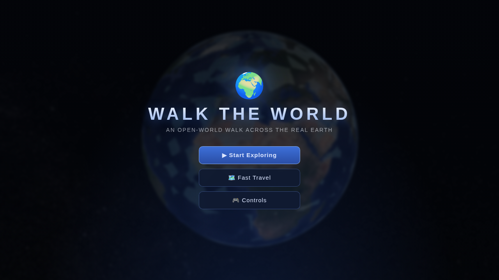
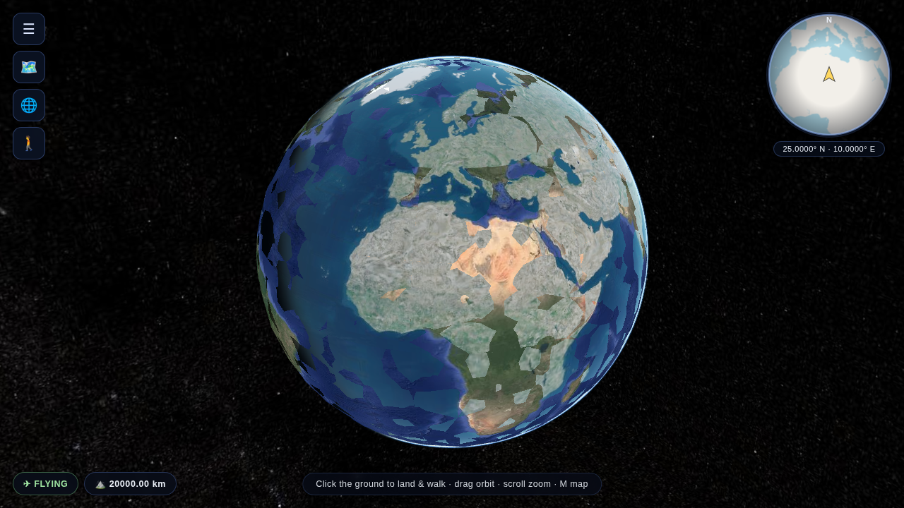
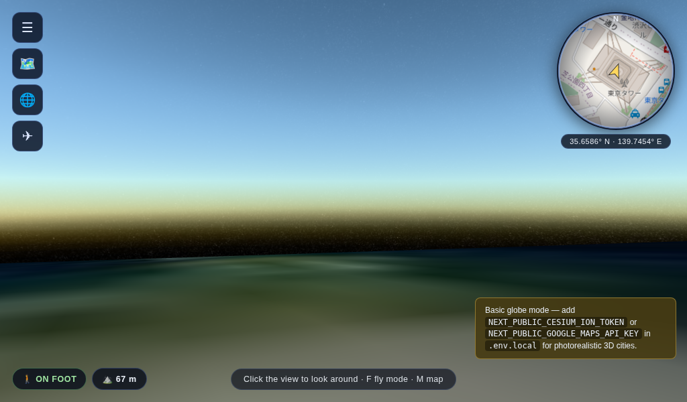
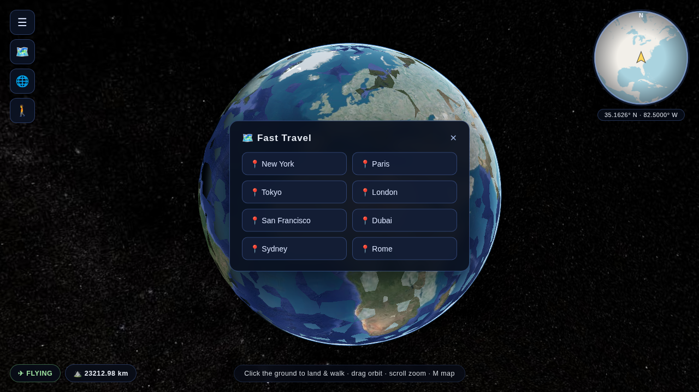
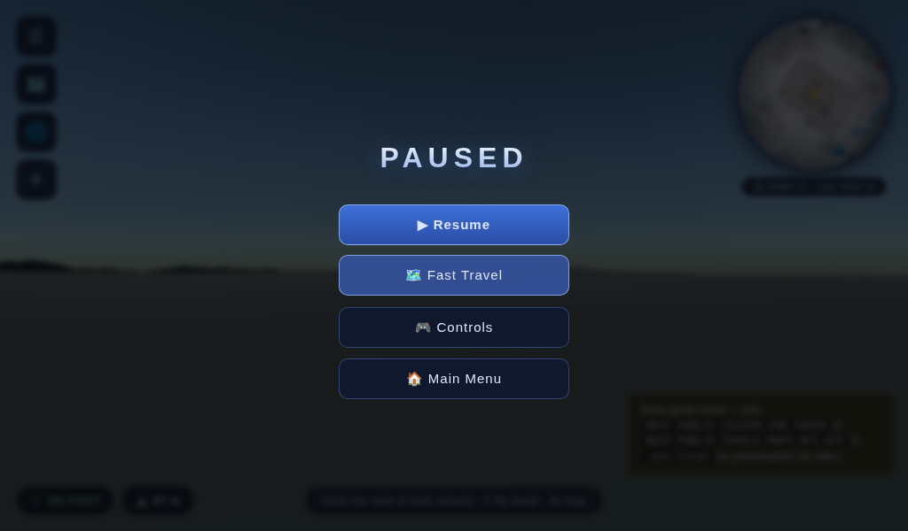
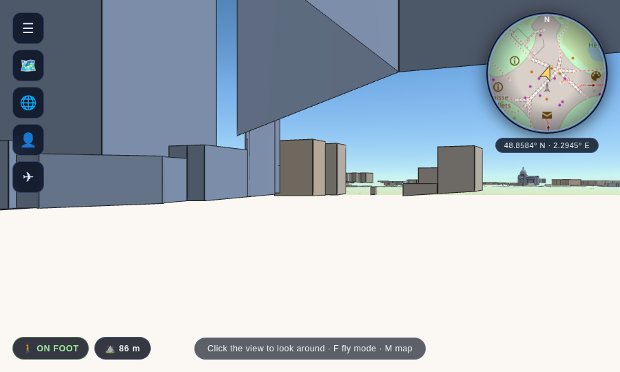

# 🌍 Walk the World

A Next.js app with an **open-world-game UI**: title menu screen, circular
minimap with a player arrow, fast-travel panel, pause menu, and an interactive
3D **CesiumJS** globe. Spin the Earth, click anywhere (or fast-travel to a
city), and fly down into a **stylized 3D world**: clean extruded buildings
(Cesium OSM Buildings, colored by type and height), a crisp game-map ground
layer (Carto/OSM), and real elevation — a beach is at sea level, Everest base
camp is at 5,300 m. Walk in **first person** or press **V** for a
**third-person view** with an animated character. A GTA-style location title
announces each area you enter (free reverse geocoding), famous buildings are
highlighted **gold as monuments** with floating labels, and a loading screen
with progress stages opens the game. Single-player, free to run, non-commercial.

## What is CesiumJS?

[CesiumJS](https://cesium.com/platform/cesiumjs/) is an open-source WebGL library
for 3D globes and maps. Unlike a textured sphere, it streams real geospatial data
— world terrain, imagery, and **3D Tiles** like Cesium OSM Buildings, a global
layer of extruded building meshes from OpenStreetMap. That makes the "walk
around a real place" experience a genuine navigable 3D world rather than flat
photos — and because the buildings are styleable geometry (not photogrammetry),
the world gets a clean, designed game look. This app uses CesiumJS `1.142`.

## Runs with zero config

The app works immediately with **no tokens** — it falls back to Cesium's bundled
Natural Earth imagery, so you get a spinnable 3D globe out of the box. Add a token
to unlock real terrain and the 3D buildings layer.

## Setup

```bash
npm install
npm run dev      # http://localhost:3000
```

**Cesium is not an npm dependency** — the browser bundle, Workers, and textures
all load from **unpkg CDN** at runtime. That keeps `npm install`, builds, and
deploy artifacts tiny, so the app builds fast and hosts fine on Vercel and
similar platforms. To self-host the assets, set `NEXT_PUBLIC_CESIUM_BASE_URL`
to a URL serving `Build/Cesium` and redeploy.

### Unlock terrain + 3D buildings (recommended)

```bash
cp .env.local.example .env.local
```

Then add your token to `.env.local`:

- **`NEXT_PUBLIC_CESIUM_ION_TOKEN`** — free (non-commercial) from
  <https://ion.cesium.com/tokens>. Enables Cesium World Terrain and Cesium OSM
  Buildings — the only account/key this project needs. If your host caps
  secret length, split it across **`_1`**/**`_2`** parts (the app concatenates).

The Carto basemap, the minimap (OSM tiles), and the avatar model load without
any key.

Restart `npm run dev` after editing the file.

## Run with Docker

The repo ships a production `Dockerfile` (multi-stage, Next.js standalone output)
and a `docker-compose.yml`. From the project folder:

```bash
docker compose up --build
```

Then open <http://localhost:3000>. To stop: `Ctrl+C`, or `docker compose down`.

Prefer plain Docker?

```bash
docker build -t walk-the-world .
docker run --rm -p 3000:3000 walk-the-world
```

### Tokens with Docker

`NEXT_PUBLIC_*` values are baked into the client bundle **at build time**, so
tokens must be supplied to the *build*, not just the run:

- **Compose:** create a `.env` file (copy `.env.local.example` to `.env`) with
  your token(s); Compose passes them in as build args automatically. Re-run
  `docker compose up --build`.
- **Plain Docker:**

  ```bash
  docker build \
    --build-arg NEXT_PUBLIC_CESIUM_ION_TOKEN=YOUR_TOKEN \
    -t walk-the-world .
  docker run --rm -p 3000:3000 walk-the-world
  ```

Builds are fast — Cesium isn't compiled or bundled, only the small Next.js app.

## Screenshots

| Menu | Globe | Walking |
|---|---|---|
|  |  |  |
| **Fast travel** | **Pause** | **Styled city (Paris)** |
|  |  |  |

## Controls

### Fly mode (the globe)

- **Click** anywhere on the globe, or tap a **city button**, to fly down and
  land there — you drop straight into walk mode at ground level.
- **Drag** to orbit · **scroll** to zoom.
- **WASD** free-fly · **Q/Space** up · **E/Shift** down (speed scales with altitude).

### Walk mode (street level)

- **Mouse** to look around (pointer lock — click the view to capture, **Esc** to release).
- **WASD** (or arrows) to walk at eye height · **Shift** to run.
- The camera **follows the terrain** — walk uphill and your elevation climbs;
  the HUD shows meters above sea level.
- **V** toggles first/third person (animated character + chase camera).
- **F** toggles walk/fly · **M** fast travel · **P** pause menu.
- Exiting walk mode rises to a 350 m vantage where orbit/zoom feel natural;
  fly mode has **no collision** — pass through anything.
- **Icon toolbar** (top-left): menu, fast travel, globe view, walk/fly toggle.
- **Minimap** (top-right): live OpenStreetMap view centered on you, with a
  heading arrow and your coordinates.
- **Location titles**: entering a new area shows its name, GTA-style
  (bottom-right), via keyless reverse geocoding (BigDataCloud).
- **Monuments**: famous buildings (Eiffel Tower, Colosseum, Burj Khalifa, …)
  are gold with a ★ label — see `lib/monuments.js` to add more. Drop a GLB in
  `public/monuments/` and wire it in to replace one with a real model.
- **FPS chip** (bottom-left) shows live frame rate. Performance tuning:
  building/terrain LOD (`maximumScreenSpaceError`), dynamic screen-space
  error, fog-based tile culling, FXAA off — tweak in `components/Globe.js` if
  you want more detail instead of frame rate.

## Street Engine (Three.js) — the engine rewrite

`/street?lat=..&lon=..` runs a custom **Three.js** street-level engine (press
🎮 in walk mode to switch): terrain from AWS Terrarium tiles, buildings and
roads extruded from Overpass/OSM and merged into a handful of draw calls,
footprint-grid collision, road-snapped spawn, first/third person. It benched
**~7× faster** than the Cesium walk mode with ~45× less memory — see
[BENCHMARK.md](BENCHMARK.md) for methodology and numbers.

## Cloudflare R2 integration (write-through city cache)

City data is cached server-side in a **Cloudflare R2 bucket** (S3-compatible,
via `@aws-sdk/client-s3`):

1. Street Engine asks `GET /api/city/<key>` → streamed from R2 if present.
2. On a miss it fetches Overpass live, renders, then `PUT`s the JSON back —
   whatever gets rendered once is uploaded; every later visit (any machine)
   streams from R2.
3. localStorage still short-circuits repeat visits on the same machine.

Configure in `.env.local` (server-side only): `R2_ENDPOINT`
(`https://<account_id>.r2.cloudflarestorage.com`), `R2_ACCESS_KEY_ID`,
`R2_SECRET_ACCESS_KEY`, `R2_BUCKET_NAME`. Create the token under Cloudflare
→ R2 → Manage API Tokens with Object Read & Write on the bucket. Without
credentials the API returns 501 and the app quietly uses Overpass +
localStorage.

### Overture buildings fallback (fills OSM-sparse cities)

Where OSM has few mapped buildings, the engine pulls ML-detected footprints
from **Overture Maps** (2.6B buildings) via `/api/overture/<cell>` — a
DuckDB-over-S3 query, R2-cached per cell. One-time setup (~15–25 min, reads
only parquet footers to build a file index into R2):

```bash
npm run overture-index
```

Check status: `GET /api/overture-index`. Without the index the layer simply
stays off. Note: per-cell queries need a persistent Node process
(`next start` / self-host); pure serverless may hit function time limits on
cold cells.

**Walking now defaults to the Street Engine** (~7× faster than Cesium walk
mode, see [BENCHMARK.md](BENCHMARK.md)): traveling anywhere plays the Cesium
fly-down, then hands off to `/street`. Switch back to the classic Cesium
walker in ⚙ Settings → Walk engine.

## Project structure

```
app/
  page.js                 Cesium globe page (fly/travel layer) + HUD
  street/page.js          Street Engine page (default walk experience)
  api/city/[key]/         R2 write-through cache for city cells
  api/overture/[key]/     Overture buildings per cell (DuckDB + R2)
  api/overture-index/     one-time Overture file-index status/build
components/
  Globe.js                CesiumJS engine (globe, fly, classic walk)
  StreetEngine.js         Three.js street engine (terrain, city, player)
  Minimap.js              canvas minimap (OSM tiles, posRef-driven)
  hud/Panels.jsx          shared panels: loading, travel, settings, pause
lib/
  engine/geo.js           slippy tile math + local ENU frame
  engine/styles.js        building/road palettes
  engine/textures.js      procedural canvas textures (facades, roads, rail)
  engine/props.js         OSM tag → 3D asset builders
  engine/cityData.js      cache-first city fetch (localStorage → R2 → Overpass)
  r2Server.js             Cloudflare R2 client (server-only)
  overtureServer.js       DuckDB-over-S3 Overture queries (server-only)
  geo.js / monuments.js   fast-travel spots, monument registry
scripts/
  build-overture-index.mjs  one-time Overture footer scan → R2 manifest
```

## How it works

- `components/Globe.js` — the whole app: creates the Cesium `Viewer`, sets a
  no-token Natural Earth base + Carto game-map layer, upgrades to ion terrain
  and styled `createOsmBuildingsAsync()` buildings, handles click-to-fly, the
  third-person avatar entity + chase camera, and the walk loop: pointer-lock
  mouse look, WASD movement, and per-frame ground clamping via
  `scene.sampleHeight` (buildings excluded) with `globe.getHeight` fallback.
- `app/page.js` — UI overlay (title, walk HUD with elevation, city shortcuts,
  globe button, token hint) and the dynamic (client-only) import of the globe.
- `lib/loadCesium.js` — loads the Cesium browser bundle from CDN via
  `<script>` (avoids webpack bundling Cesium, which breaks in production).
- `lib/cesium.js` — resolves `CESIUM_BASE_URL` for Workers/Assets.
- `lib/geo.js` — the city shortcut coordinates.

## Notes

- *